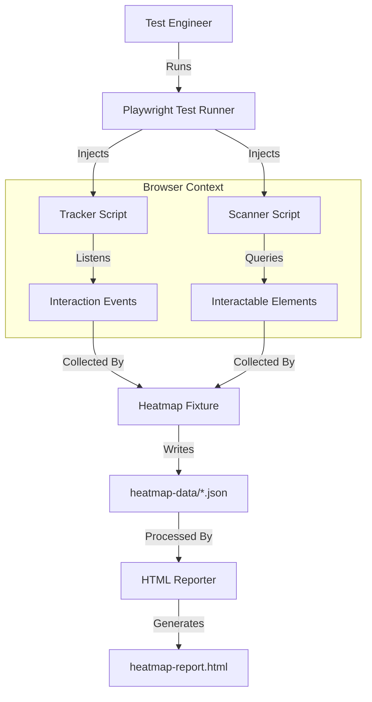
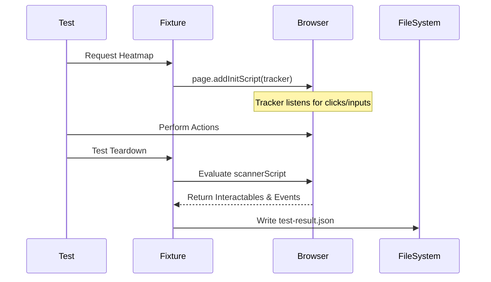

# Saturday Playwright Heatmap

A Playwright plugin that visualizes test coverage by tracking user interactions (clicks, inputs) and comparing them against all available interactable elements on the page.

## Features

- **Interaction Tracking**: Automatically records `click`, `input`, and `change` events.
- **Interactable Scanning**: Scans the DOM for buttons, links, and inputs to understand what *could* be tested.
- **Visual Heatmaps**: Generates HTML reports overlaying interactions (Red Dots) on top of available elements (Cyan Boxes).

## Installation

```bash
pnpm add @orieken/saturday-playwright-heatmap
```

## Usage

### 1. Register the Fixture

In your test file or a global `fixtures.ts`:

```typescript
import { test as base } from '@playwright/test';
import { test as heatmapTest } from '@orieken/saturday-playwright-heatmap';

export const test = base.extend(heatmapTest);
```

### 2. Run Your Tests

Use the `heatmap` fixture in your tests. No extra code is needed; the fixture auto-injects the tracker.

```typescript
test('user login flow', async ({ page, heatmap }) => {
  await page.goto('/login');
  await page.getByTestId('username').fill('wizard');
  await page.getByTestId('password').fill('secrets');
  await page.getByRole('button', { name: 'Login' }).click();
});
```

### 3. Generate Report

After running tests, generate the visual report:

```bash
node node_modules/@orieken/saturday-playwright-heatmap/dist/reporter.js heatmap-data heatmap-report.html
```

## Architecture

### System Overview



### Workflow


