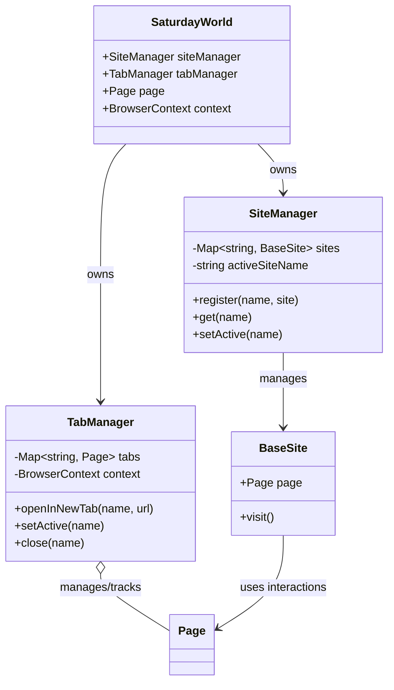
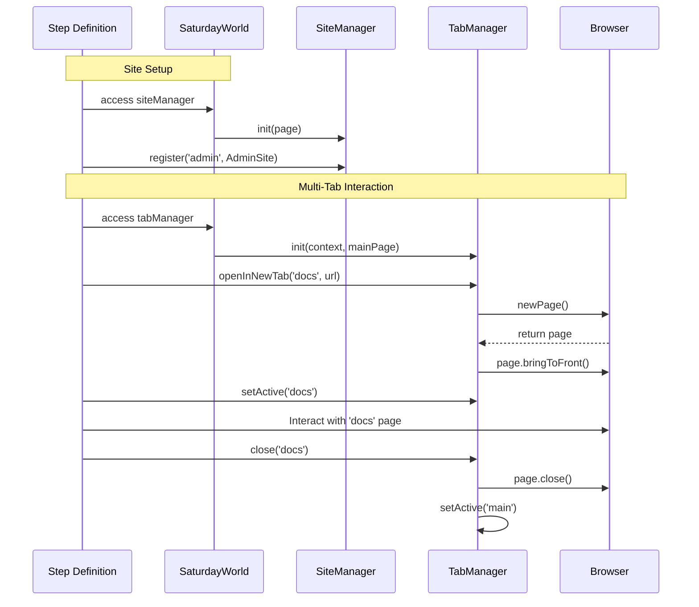

# Site and Tab Management

The Saturday framework provides built-in managers for handling complex testing scenarios involving multiple web sites and multiple browser tabs.

## Overview

- **SiteManager**: Manages `BaseSite` instances. Useful for tests that interact with multiple different applications or sites in a single flow (e.g., cross-site data transfer, OAuth flows).
- **TabManager**: Manages Playwright `Page` instances as tabs. Useful for tests involving new windows, popups, or multi-tab coordination.

## Architecture

The following diagram illustrates how the `SiteManager` and `TabManager` integrate with the `SaturdayWorld` and Playwright components.



## Workflow Example

Typical interaction flow for a multi-tab test scenario:



## SiteManager

The `SiteManager` allows you to register and switch between different Site objects.

### Usage

```typescript
// In a step definition
import { FooSite, BarSite } from 'my-sites';

Given('I use multiple sites', async function() {
  // Register sites
  this.siteManager.register('foo', new FooSite(this.page));
  this.siteManager.register('bar', new BarSite(this.page));

  // Use a site
  const foo = this.siteManager.get<FooSite>('foo');
  await foo.homePage.visit();

  // Switch active reference (optional, for state tracking)
  this.siteManager.setActive('bar');
});
```

### API

- `register(name: string, site: BaseSite): void` - Register a site instance.
- `get<T>(name: string): T` - Retrieve a site by name.
- `setActive(name: string): void` - Mark a site as active (updates internal tracking).
- `getActive<T>(): T` - Get the currently active site.
- `listSites(): string[]` - List registered site names.

## TabManager

The `TabManager` wraps Playwright's `BrowserContext` to simplify multi-tab handling.

### Usage

```typescript
When('I open a link in a new tab', async function() {
  // Explicitly open in new tab
  const detailsPage = await this.tabManager.openInNewTab(
    'details', 
    'https://example.com/details',
    { purpose: 'Verification' }
  );
  
  // Or handle a link that opens a new tab/window
  // (Note: For implicit popups, standard Playwright handling is recommended, 
  // but you can register them manually if managed tracking is needed)
});

Then('I check the tabs', async function() {
  // Switch to specific tab
  this.tabManager.setActive('details');
  const page = this.tabManager.getActive();
  
  await expect(page.locator('h1')).toHaveText('Details');
  
  // Close it
  await this.tabManager.close('details');
  // Auto-reverts to 'main' or next available
});
```

### API

- `openInNewTab(name: string, url: string, metadata?: TabMetadata): Promise<Page>` - Create and register a new tab.
- `get(name: string): Page` - Get a page by name.
- `setActive(name: string): void` - Switch focus to a tab (brings to front).
- `close(name: string): Promise<void>` - Close a specific tab.
- `closeAll(keepMain: boolean): Promise<void>` - Close all tabs (default keeps 'main').
- `forEach(callback)` - Iterate over all tabs.

## Integration with Reporting

The framework automatically attaches:
- Screenhots from the *active* tab.
- A list of all open tabs and their URLs.
- A list of all registered sites.

This ensures that test artifacts correctly reflect the state of multi-tab/multi-site tests.
