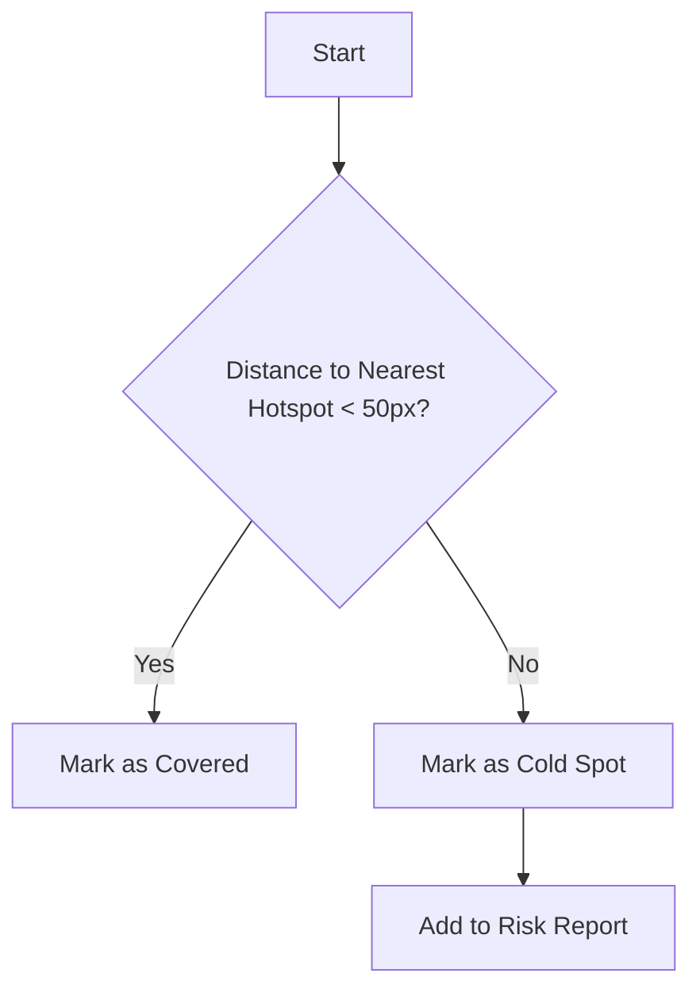

# Saturday ML Analyzer

A machine-learning powered tool that analyzes test execution heatmaps to identify "Cold Spots"—areas of your application that are accessible but have low or zero test coverage.

## Features

- **K-Means Clustering**: Uses `ml-kmeans` to group scattered interaction events into "Hotspots".
- **Cold Spot Detection**: Mathematically calculates which interactable elements are furthest from any known interaction cluster.
- **Coverage Scoring**: Provides a quantitative "Coverage Score" based on interactions vs. opportunities.

## Installation

```bash
pnpm add @orieken/saturday-ml-analyzer
```

## Usage

### CLI

Run the analyzer against a directory containing heatmap JSON data (generated by `@orieken/saturday-playwright-heatmap`).

```bash
node dist/index.js <path-to-heatmap-data>
```

**Example Output:**

```text
Test: User Login (passed)
  Coverage Score: 85.0%
  Hotspots: 3 (Username, Password, Submit)
  Cold Spots: 2
    - a "Forgot Password" 
    - a "Sign Up"
```

### API

You can also use the analyzer programmatically:

```typescript
import { HeatmapAnalyzer } from '@orieken/saturday-ml-analyzer';

const analyzer = new HeatmapAnalyzer();
const result = analyzer.analyze(testData);

console.log(result.coldSpots);
```

## How It Works

### Analysis Workflow

```mermaid
graph LR
    Input[Heatmap JSON] -->|Read| Loader
    Loader -->|Extract| Inter[Interactions (x,y)]
    Loader -->|Extract| Elements[Interactables]
    
    Inter -->|K-Means| Clustering[Identify Hotspots]
    
    Clustering & Elements -->|Distance Calc| Comparator
    
    Comparator -->|Output| ColdSpots[Cold Spots]
    Comparator -->|Output| Score[Coverage %]
```

### Clustering Logic

The analyzer uses a proximity threshold to determine if an element was "tested".


