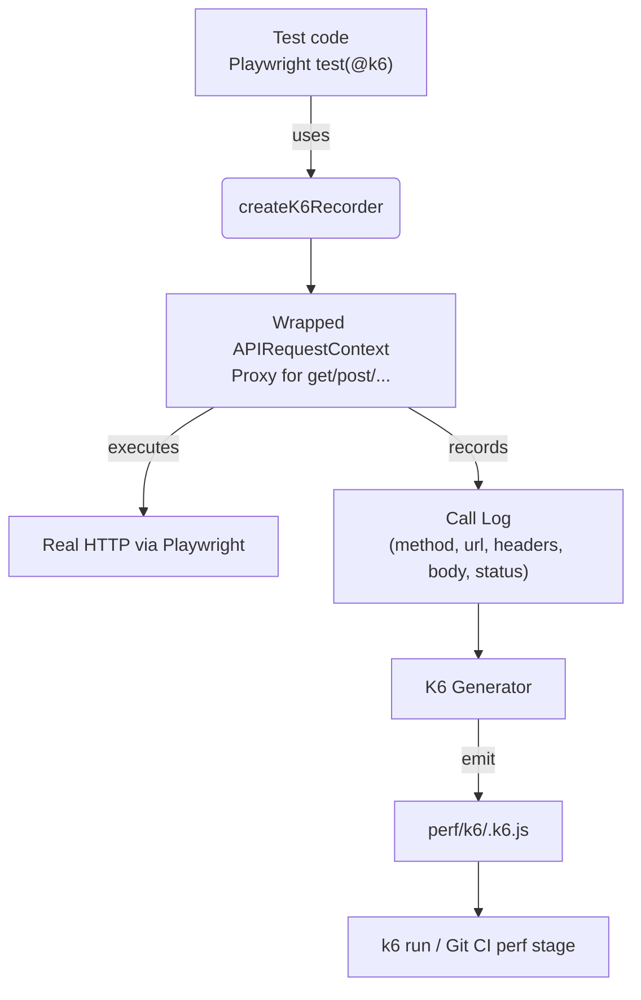
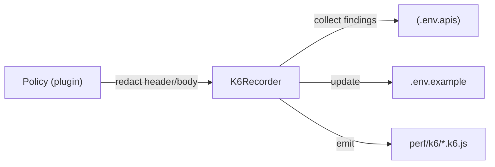
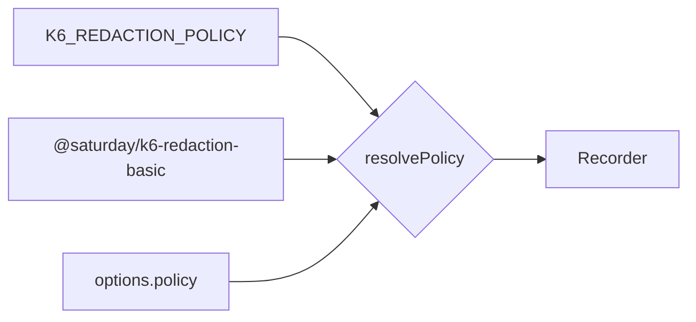

# Architecture — @saturday/playwright-k6-exporter

This package captures **Playwright API calls** during tests and generates **k6** scripts that mirror those calls.

## Key Components

- **K6Recorder**: collects calls and converts them to a k6 script.
- **createK6Recorder**: helper to create a wrapped `APIRequestContext` per test.
- **Fixture**: `@saturday/playwright-k6-exporter/fixture` adds a Playwright `test` with tag-aware exporting.
- **CLI**: `k6-exporter-init` scaffolds an example spec and adds helpful npm scripts.

## Data Flow

1. Test calls `createK6Recorder(testInfo.title)` → gets wrapped `APIRequestContext`.
2. All HTTP verbs (`get`, `post`, `put`, `patch`, `delete`, `head`, `fetch`) are proxied.
3. Each call is appended to the recorder's call log (normalized headers/body).
4. On `flushToK6()` (or fixture teardown), a k6 script is written:
   - `default` function reproduces calls with `http.request`.
   - Each call has a `check` assertion and small `sleep` to space events.
5. Generated scripts are idempotent (filename derived from test title slug).

## Boundaries & Responsibilities (DDD-lite)

- **Application**: test orchestration (Playwright test files).
- **Domain**: `RecordedCall`, slugging rules, idempotent write policy.
- **Infrastructure**: Playwright request context proxy, file IO for k6 output.

## Extensibility

- **Redaction**: plug a sanitizer into the recorder before `flushToK6()`.
- **Scenarios**: inject k6 `options` via per-test metadata or env.
- **Batching**: detect concurrency and replace sequences with `http.batch`.

## Redaction & Env Emission

- Policies replace secrets with `${ENV_VAR}` placeholders.
- The recorder writes `.env.apis` (local values) and updates `.env.example` (keys only).
- Teams map secrets via CI/Secrets Manager to env vars for k6 runtime.

## Policy Auto-Discovery

Resolution order:
1) `options.policy` if provided by the caller
2) `import(process.env.K6_REDACTION_POLICY)` if set
3) `import('@saturday/k6-redaction-basic')` as a sensible default
