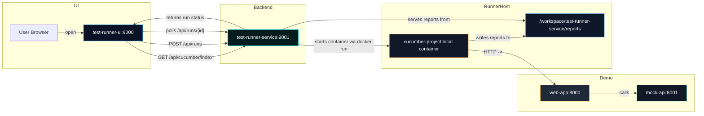

# Test Runner Demo — Workflow

This document describes the full workflow for the Test Runner demo (UI + service + demo web-app + mock-api + cucumber runner). It includes a mermaid diagram showing the components and interactions, step-by-step instructions to run the stack locally, troubleshooting tips, and a short plan for automating the demo.

Folders referenced in this document:
- `final/test-runner-ui` — frontend UI (Vite + Vue 3 + Pinia). Default dev port: 9000.
- `final/test-runner-service` — Go backend / orchestrator. Default port: 9001.
- `final/web-app` — demo storefront that the tests exercise. Default port: 8000.
- `final/mock-api` — mock API used by `web-app`. Default port: 8001.
- `final/cucumber-project` — the CucumberJS + Playwright project container used to execute tests.
- `final/docker-compose.yml` — compose file to run the stack (test-runner-service, test-runner-ui, web-app, mock-api).

Ports (default mapping)
- `test-runner-ui` — http://localhost:9000
- `test-runner-service` — http://localhost:9001
- `web-app` — http://localhost:8000
- `mock-api` — http://localhost:8001

Mermaid component diagram



High-level workflow (text)
1. The UI (`test-runner-ui`) fetches available cucumber feature indexes from the `test-runner-service` at `GET /api/cucumber/index` and renders suites/features/scenarios.
2. When the user clicks the `Run` button on a scenario, the UI calls `POST /api/runs` on `test-runner-service` with `{ framework, suiteId, scenarioId }`.
3. `test-runner-service` creates a run record and spawns a test container by executing a `docker run` using the `cucumber-project:local` image. The service mounts a reports directory from the host into the container (e.g. `/workspace/test-runner-service/reports` -> `/app/reports`) and passes `BASE_URL=http://web-app:8000` into the test container so Playwright tests point to the compose `web-app` service.
4. The cucumber container runs CucumberJS + Playwright, drives a browser, hits `web-app` within the compose network, and writes JSON/HTML reports to `/app/reports/<suite>/<run>/`.
5. `test-runner-service` polls or queries the run's status, and exposes `GET /api/runs/{id}` for the UI to poll. When finished the run record includes a `reportUrl` (e.g. `/reports/<suite>/<run>/index.html`).
6. The UI polls the run status and shows a toast notification on run start/finish and a link to the report when available.

Manual local run — step by step

Checklist (manual):
- [ ] Build `cucumber-project` image locally
- [ ] Start the stack (mock-api, web-app, service, ui)
- [ ] Register cucumber index (if not pre-registered)
- [ ] Open UI and trigger a run
- [ ] Observe run status, view report

1) Build the cucumber image (required for `test-runner-service` to be able to spawn the test container):

```bash
cd final/cucumber-project
docker build -t cucumber-project:local .
```

2) Start the required services using Docker Compose (detached):

```bash
cd final
docker compose up --build -d mock-api web-app test-runner-service test-runner-ui
```

Notes:
- `docker compose` must be the v2 style (Docker Desktop / Docker CLI supporting `docker compose`).
- `test-runner-service` mounts `/var/run/docker.sock` so it can start containers on the host; ensure your environment allows this.

3) (Optional) Register the cucumber index if it's not already present in `test-runner-service/data/cucumber_index.json`:

```bash
curl -sS -X POST http://localhost:9001/api/cucumber/index \
  -H "Content-Type: application/json" \
  --data-binary @final/test-runner-service/data/cucumber_index.json | jq .
```

4) Open the UI:
- Visit: `http://localhost:9000`
- The Cucumber Index widget should list suites/features/scenarios.

5) Trigger a run:
- Click the `Run` button next to a scenario.
- The UI shows a toast "Started run <id>" and the Runs panel on the right will list the run.
- The run will show status `running` while the container executes. The UI polls `GET /api/runs/{id}`.

6) View report when finished:
- When the run completes the store shows `passed`/`failed` and a `report` link in the Runs panel.
- Open the report link (served by `test-runner-service` under `/reports/<suite>/<run>/index.html`).

7) Stop the stack when done:

```bash
cd final
docker compose down
```

Troubleshooting (common issues & fixes)
- Problem: `test-runner-service` logs "could not load initial cucumber_index.json" on startup.
  - Explanation: the file `final/test-runner-service/data/cucumber_index.json` is optional — the service starts without it. Register the index via POST if needed.
- Problem: cucumber container exits immediately / tests show `ERR_CONNECTION_REFUSED` to `http://localhost:5173`.
  - Explanation: tests inside the container must hit the compose service host name `web-app:8000`. We set `BASE_URL=http://web-app:8000` when test-runner spawns the container. Make sure `web-app` is running in the same compose network.
- Problem: docker CLI or socket permission denied inside `test-runner-service` container.
  - Explanation: we mount `/var/run/docker.sock` into the container and installed `docker-cli` in the image. If permission denied, run compose with user that has Docker access or adjust socket group.
- Problem: UI cannot fetch `/api/...` due to CORS / host mismatch when running in Docker.
  - Fix: The Vite dev server proxies `/api` to `http://localhost:9001`. If running the UI container in compose, ensure the UI's requests target a host reachable by the browser (usually `http://localhost:9001` on the developer machine) or adjust `VITE_API_BASE` env during build.

Automating the demo (script outline)

We can create a small `final/scripts/run-demo.sh` that automates these steps:
- Build `cucumber-project` image
- docker compose up --build (services)
- POST the cucumber index to the service
- Optionally trigger a run via curl and poll the run status until completion (or wait and open the report URL)

Example script skeleton (`final/scripts/run-demo.sh`):

```bash
#!/usr/bin/env bash
set -euo pipefail
ROOT_DIR="$(cd "$(dirname "$0")/.." && pwd)"
cd "$ROOT_DIR/cucumber-project"
docker build -t cucumber-project:local .
cd "$ROOT_DIR"
docker compose up --build -d mock-api web-app test-runner-service test-runner-ui

# register index (optional)
if [ -f test-runner-service/data/cucumber_index.json ]; then
  curl -sS -X POST http://localhost:9001/api/cucumber/index -H "Content-Type: application/json" --data-binary @test-runner-service/data/cucumber_index.json | jq .
fi

# trigger one run (adjust scenario id as needed)
RUN_ID=$(curl -sS -X POST http://localhost:9001/api/runs -H "Content-Type: application/json" -d '{"framework":"cucumber","suiteId":"final-cucumber-project","scenarioId":"webapp_cart.feature:9"}' | jq -r '.id')

# poll status until done
while true; do
  STATUS=$(curl -sS http://localhost:9001/api/runs/$RUN_ID | jq -r '.status')
  echo "Run $RUN_ID status: $STATUS"
  if [ "$STATUS" != "running" ]; then
    echo "Done. Report URL: $(curl -sS http://localhost:9001/api/runs/$RUN_ID | jq -r '.reportUrl')"
    break
  fi
  sleep 2
done
```

(We can create this script for you if you want.)

Security & improvements
- Using the host Docker socket is powerful but risky. For a production runner consider:
  - Running a dedicated runner process with a secured API
  - Using the Docker SDK with appropriate auth or offloading to Kubernetes jobs
- Add Compose `healthcheck` entries so services start deterministically and the UI waits for the service to be healthy.
- Stream logs using SSE / WebSocket instead of client polling.

Where to go next
- I can create the `final/scripts/run-demo.sh` automation script for you and add it to the repo.
- I can add Compose healthchecks and a service `cucumber` to run tests via compose.
- I can add a small `README` snippet into `final/README.md` referencing this workflow.

---

If you want I will now:
- create the automation script `final/scripts/run-demo.sh` and add a short `final/README.md` snippet, then run the demo end-to-end here and paste logs (build, start, register, trigger, and show report path).

Which of these should I do next?
