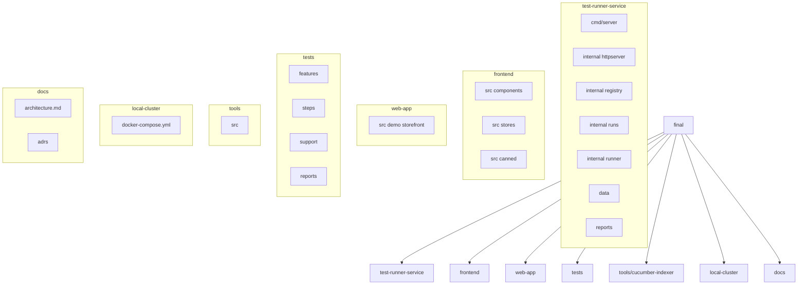

Target Project Structure (Final)

This document defines the intended `final/` directory structure that consolidates the prototypes into a single, coherent monorepo layout. It also documents what each top-level folder is for and suggests package names in the `@saturday` namespace for packages we publish or reference locally.

Directory Tree

```text
final/
├─ test-runner-service/   # Go HTTP API + runner (service that executes test runs and serves reports) — listens on port 9001 in dev
│  ├─ cmd/server/
│  ├─ internal/
│  │  ├─ httpserver/
│  │  ├─ registry/
│  │  ├─ runs/
│  │  └─ runner/
│  ├─ data/              # Imported CucumberIndex JSON
│  └─ reports/           # HTML + JSON reports per run
├─ frontend/             # Test-runner UI (Vue 3 + Vite + Pinia) — dev server listens on port 9000 and proxies /api to test-runner-service:9001
│  └─ src/
│     ├─ components/
│     ├─ stores/
│     └─ canned/
├─ web-app/              # Demo storefront used by tests (small Vue app) — dev server listens on port 8000 and proxies /api to mock-api:8001
│  └─ src/               # DnD magical items demo used for Playwright/Cucumber demos
├─ mock-api/             # Simple mock API for the demo web-app (items + orders) — listens on port 8001
├─ tests/                # CucumberJS + Playwright workspace (test definitions & harness)
│  ├─ features/
│  ├─ steps/
│  ├─ support/
│  └─ reports/
├─ tools/
│  └─ cucumber-indexer/  # TS CLI to build & POST Cucumber index (also: future indexers here)
├─ local-cluster/        # docker-compose for local dev
└─ docs/                 # Architecture, ADRs, contribution, quality rules
```

What each folder is for (explicit)

- `test-runner-service/`
  - Purpose: the service that runs tests (or orchestrates runners), accepts run requests, stores run metadata and generated reports, and exposes an HTTP API used by the UI and CI.
  - Dev port: 9001 (default) — the `frontend` dev server proxies `/api` to this port.
  - Suggested package name (when published or referenced as a package): `@saturday/test-runner-service`.

- `frontend/`
  - Purpose: the test-runner web UI (dashboard) where operators inspect suites, start runs, and view reports.
  - Dev port: 9000 (default) and proxies `/api` to `http://localhost:9001`.
  - Suggested package name: `@saturday/test-runner-ui`.

- `web-app/`
  - Purpose: a small demo storefront (DnD magical items) used by end-to-end tests (Playwright/Cucumber). This is intentionally lightweight and exists so the test-runner can run tests against a predictable demo site.
  - Dev port: 8000 (default) and proxies `/api` to the mock API on `http://localhost:8001`.
  - Suggested package name (optional): `@saturday/demo-webapp` or keep unscoped as a fixture.

- `mock-api/`
  - Purpose: simple mock API serving items and orders only for the demo web-app. It intentionally does NOT serve Cucumber feature/index information — the `test-runner-service` provides that on port 9001.
  - Dev port: 8001 (default).

- `tests/`
  - Purpose: contains test specifications (Cucumber features, step definitions, Playwright specs) and any test-runner harness code.
  - Notes: tests should be able to run against `web-app` (demo) and the `test-runner-service`.

- `tools/cucumber-indexer/`
  - Purpose: TypeScript CLI that scans feature files and builds a Cucumber index (metadata) which can be POSTed to the backend or used by the UI.
  - Suggested package name: `@saturday/cucumber-indexer`.

Package naming and namespace

- The repo will adopt the `@saturday` npm scope for packages we publish or reuse internally (monorepo or multi-package setup). Suggested initial package names:
  - `@saturday/test-runner-ui` — frontend dashboard (Vue)
  - `@saturday/test-runner-service` — backend service / API
  - `@saturday/cucumber-indexer` — cucumber feature indexer CLI
  - `@saturday/demo-webapp` — (optional) demo storefront used for tests

TODOs and roadmap items

- [ ] Publish or rename frontend package to `@saturday/test-runner-ui` (update `package.json` when ready).
- [ ] Publish or rename backend package to `@saturday/test-runner-service` (or `@saturday/test-runner-api`).
- [ ] Publish `@saturday/cucumber-indexer` and add docs for how it maps features into the backend index.
- [ ] Add `@saturday/jest-indexer` (new) — TODO: design the index format for Jest and implement a small CLI that creates the same shape index or a compatible one.
- [ ] Add `@saturday/playwright-indexer` (new) — TODO: design and implement.
- [ ] Add a README in `web-app/` explaining how to run the demo locally and how tests should target it.
- [ ] Add CI job(s) that validate the demo web app and indexers (lint, build, smoke tests).

Mermaid Diagram (unchanged)



Notes

- Keep the public API surface the same as in the prototypes to reduce migration friction.
- Prefer composition over duplication: extract shared types (e.g., `CucumberIndex`) into a single source (test-runner-service `internal` or a small shared TS type file for the indexer/tests as needed).
