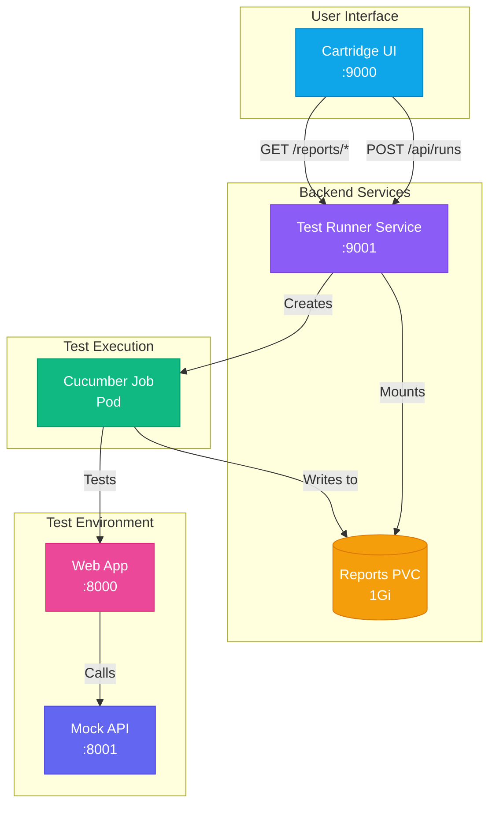
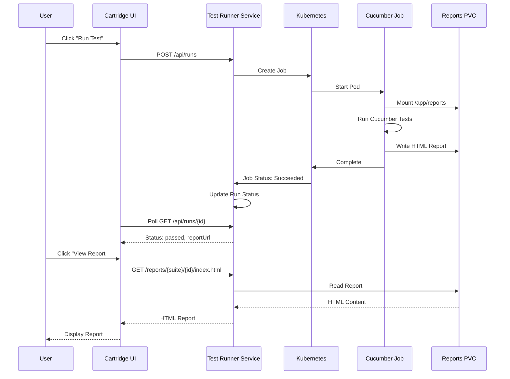
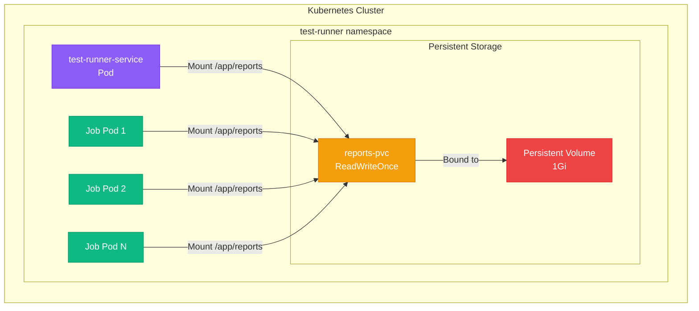
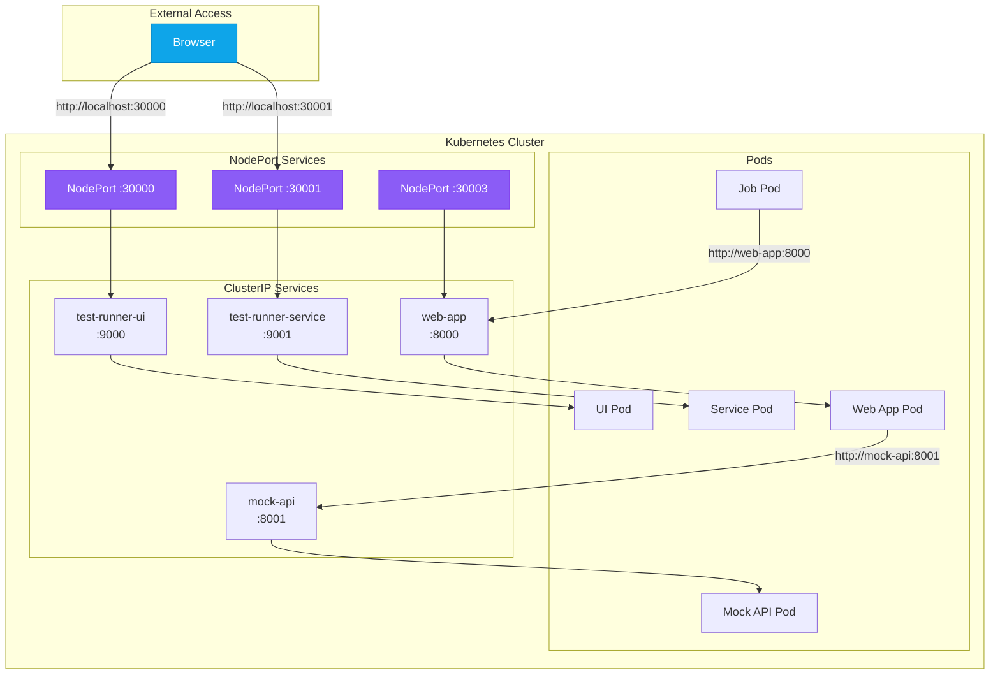
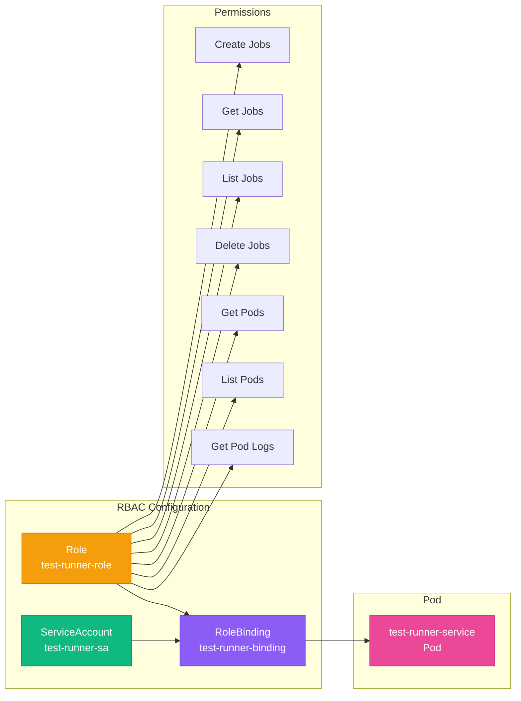
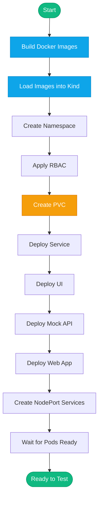

# Architecture Diagrams

## Component Overview



## Report Flow



## Storage Architecture



## Directory Structure on PVC

```
/app/reports/
├── final-cucumber-project/
│   ├── run-abc123/
│   │   ├── index.html      ← HTML report
│   │   ├── cucumber.json   ← JSON report
│   │   └── run.log         ← Test logs
│   ├── run-def456/
│   │   ├── index.html
│   │   ├── cucumber.json
│   │   └── run.log
│   └── run-ghi789/
│       ├── index.html
│       ├── cucumber.json
│       └── run.log
└── another-suite/
    └── run-xyz/
        └── ...
```

## Network Flow



## RBAC Permissions



## Deployment Process



## Before vs After

### Before (Broken)
```
┌─────────────┐
│ Service Pod │
│             │
│ /app/reports│ ← Empty directory
└─────────────┘

┌─────────────┐
│  Job Pod    │
│             │
│ /reports    │ ← Writes here (emptyDir)
└─────────────┘

❌ Reports not accessible to service!
```

### After (Fixed)
```
┌─────────────┐
│ Service Pod │
│             │
│ /app/reports│ ← Mounts PVC
└──────┬──────┘
       │
       ▼
┌─────────────┐
│ reports-pvc │ ← Shared storage
└─────────────┘
       ▲
       │
┌──────┴──────┐
│  Job Pod    │
│             │
│ /app/reports│ ← Mounts same PVC
└─────────────┘

✅ Reports accessible to both!
```
