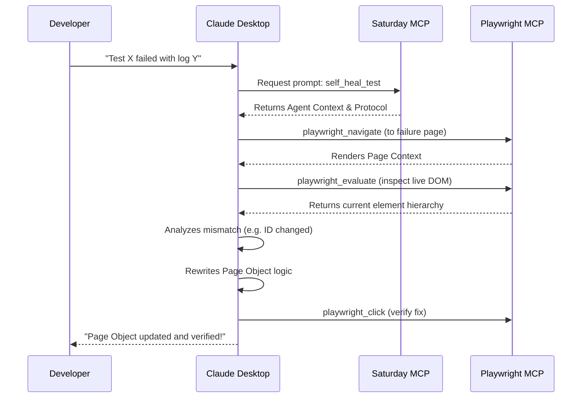
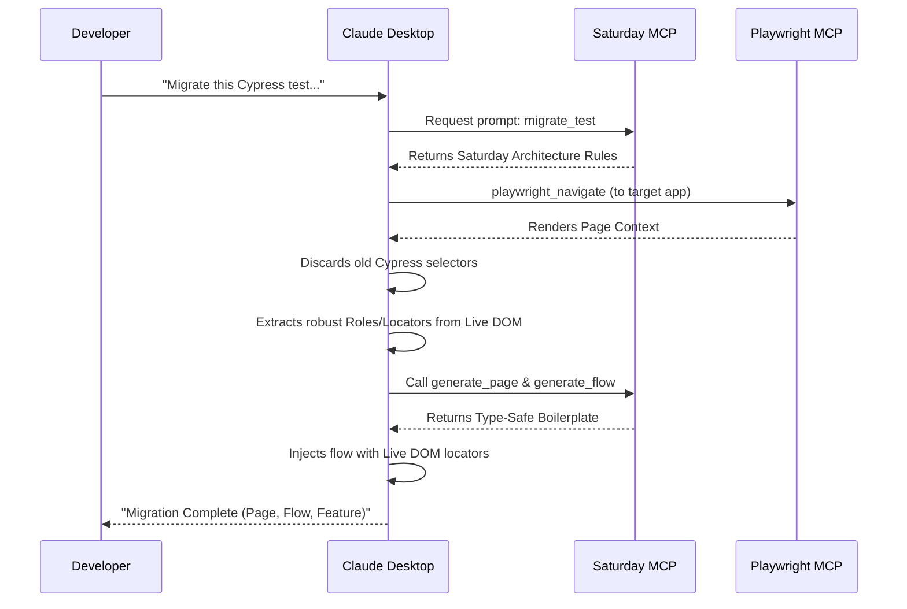

# Saturday MCP Server

A Model Context Protocol (MCP) server for the Saturday testing framework that provides code
generation, analysis, and validation tools.

## Overview

The Saturday MCP Server enables AI assistants (like Claude) to generate and analyze Saturday
framework code through a standardized protocol. It exposes three kinds of MCP capabilities:

- **Tools** — single-shot operations (generate a page, validate patterns, analyze impact)
- **Workflows** — multi-step orchestrations exposed as tools (run tests, prioritize tests)
- **Personas** — MCP prompts that inject Saturday expertise into the LLM (`saturday_sme`,
  `migrate_test`, `self_heal_test`, …)

### Platform Support

Works with multiple IDEs and AI assistants:
- Claude Desktop (recommended)
- VS Code (with GitHub Copilot, v1.102+)
- Cursor IDE
- JetBrains IDEs (IntelliJ, PyCharm, WebStorm — v2025.2+)
- Windsurf
- Antigravity (likely supported)

See [docs/IDE_COMPATIBILITY.md](./docs/IDE_COMPATIBILITY.md) for the full compatibility matrix.

## Architecture

The server follows Clean Architecture with a three-part domain vocabulary — the "trinity":
**Tool**, **Persona**, **Workflow** — defined as interfaces in `internal/domain/`. Every
external dependency (filesystem, subprocess execution, metrics file reader, OTel exporter) sits
behind a domain interface with a concrete implementation under `internal/adapters/`.

```
cmd/saturday-mcp/main.go       # entrypoint: OTel setup, handler wiring, stdio serve
internal/domain/               # Tool / Persona / Workflow / Tracer / TestRunner / FileSystem interfaces
internal/tools/                # one file per MCP tool (implements domain.Tool)
internal/workflows/            # multi-step orchestrations (implements domain.Workflow)
internal/adapters/             # concrete implementations behind domain interfaces
  ├─ testrunner/               # os/exec wrapper with context timeouts
  ├─ filesystem/               # os-backed FileSystem
  ├─ metricsfile/              # metrics.Reader implementation over JSON files
  └─ otel/                     # OTel-gRPC tracer + Noop tracer
internal/server/               # MCP protocol layer — registration, tracing middleware, thin Handler composite
internal/generators/           # code generators (Site, Page, Flow, Steps, Element, Service, Migration, Documentation)
internal/analyzers/            # framework/pattern/impact/performance/usage analyzers
internal/templates/            # embedded template registry + processor + cache
internal/prompts/              # persona provider (MCP prompt implementations)
internal/resources/            # MCP resource provider (exposes templates)
internal/validators/           # request schema validation
internal/models/               # request/response models + JSON schemas
```

Every tool invocation is wrapped in an OTel span by `internal/server/tracing_middleware.go` at
registration time — no tool's `Execute` emits spans of its own, keeping the domain layer free of
observability coupling.

Adding a new tool is: drop a file under `internal/tools/` that implements `domain.Tool`, then
append it to the slice in `internal/server/tool_provider.go`. Nothing else changes.

For the full walkthrough — layer diagram, extension points, cross-references to ADRs — see
[docs/architecture.md](./docs/architecture.md). For the retrofit that produced this shape, see
[mcp-add-plan.md](./mcp-add-plan.md). For key design decisions, see
[docs/adrs/ADR-001](./docs/adrs/ADR-001-use-invopop-jsonschema-tool-output-schemas.md) (output
schema generation) and
[docs/adrs/ADR-002](./docs/adrs/ADR-002-default-otlp-grpc-otel-trace-export.md) (OTel export
default).

## Installation

### Option 1: Download Pre-compiled Binaries (Recommended)

Download the pre-compiled `saturday-mcp` and `saturday` CLI binaries for macOS, Linux, and
Windows from the [GitHub Releases page](https://github.com/orieken/saturday-mcp/releases).

1. Download the archive for your operating system and architecture.
2. Extract the archive and move the binary to a location in your system `$PATH` (e.g.,
   `/usr/local/bin`).

### Option 2: Build from Source

If you have Go 1.25+ installed, you can build the binaries from source:

```bash
cd saturday-mcp
go mod download
go build -o bin/saturday-mcp ./cmd/saturday-mcp
go build -o bin/saturday ./cmd/cli
```

## Running the Server

If installed via binaries (Option 1):

```bash
saturday-mcp
```

If built from source (Option 2):

```bash
./bin/saturday-mcp
```

The server listens for MCP protocol messages on stdin/stdout.

## Configuration

The server takes zero required configuration and runs fully offline by default. Two optional env
vars control OpenTelemetry trace export:

| Env var                        | Effect                                                            | Default  |
|--------------------------------|-------------------------------------------------------------------|----------|
| `OTEL_EXPORTER_OTLP_ENDPOINT`  | Host:port of an OTLP-gRPC collector. Unset ⇒ no-op tracer.        | (unset)  |
| `OTEL_EXPORTER_OTLP_INSECURE`  | `true`/`1`/`yes`/`on` enables plaintext gRPC (local collectors).  | `false`  |

If exporter construction fails at startup (e.g. malformed endpoint), the server logs the error
and falls back to the no-op tracer rather than refusing to start. See
[ADR-002](./docs/adrs/ADR-002-default-otlp-grpc-otel-trace-export.md) for the rationale.

## CLI Usage

The Saturday CLI provides command-line access to all MCP server functionality without requiring
an MCP client.

### Installation

```bash
cd saturday-mcp
go build -o bin/saturday ./cmd/cli
```

### Quick Start

```bash
# Generate a Page Object
./bin/saturday generate page LoginPage --path /login --elements "username:#user:input"

# Analyze a project
./bin/saturday analyze framework ./my-project

# Validate patterns
./bin/saturday validate ./my-project

# Generate documentation
./bin/saturday docs ./my-project ./docs/API.md
```

See [CLI.md](./CLI.md) for the full CLI reference.

## Tool Inventory

The server registers 22 MCP tools (20 single-step tools plus 2 workflows) alongside its
resources and personas.

### Tools

| Name                         | Purpose                                                        |
|------------------------------|----------------------------------------------------------------|
| `generate_site`              | Generate a Site class with page and flow registration          |
| `generate_page`              | Generate a Page class with element registration                |
| `generate_flow`              | Generate a Flow class for multi-step user journeys             |
| `generate_steps`             | Generate Cucumber step definitions from Gherkin patterns       |
| `generate_element`           | Generate a custom Element/Component class                      |
| `generate_service`           | Generate an API Service class                                  |
| `migrate_code`               | Migrate legacy code (Cypress/Selenium/raw Playwright) to Saturday |
| `analyze_framework`          | Analyze existing framework structure and patterns              |
| `analyze_performance`        | Analyze code for performance bottlenecks                       |
| `analyze_impact`             | Analyze the blast radius of modifying a specific file          |
| `validate_patterns`          | Validate code against Saturday framework patterns              |
| `suggest_improvements`       | Suggest code improvements based on Saturday best practices     |
| `generate_documentation`     | Generate markdown documentation for a project                  |
| `parse_test_failure`         | Parse Playwright test output to identify failing files/lines   |
| `analyze_complexity`         | Analyze cyclomatic complexity and function length thresholds   |
| `check_accessibility`        | Check HTML/Vue/React files for accessibility violations        |
| `check_ubiquitous_language`  | Validate domain dictionary terms and language consistency      |
| `verify_dependencies`        | Verify Clean Architecture layer import dependencies            |
| `search_ki`                  | Search Knowledge Items and ADRs by query, tags, or domain      |
| `search_docs`                | Search project documentation using BM25 FTS5 retrieval         |

### Workflows

Workflows compose multiple use-cases into a coherent pipeline and are exposed to MCP clients as
tools via a thin `WorkflowTool` adapter (see `internal/tools/workflow_tool.go`).

| Name                | Purpose                                                            |
|---------------------|--------------------------------------------------------------------|
| `run_tests`         | Execute a test command (with configurable timeout) and capture output |
| `prioritize_tests`  | Load usage metrics + rank test coverage needs by production usage  |

### Resources

Templates are exposed as MCP resources under the `saturday://` scheme:

- `saturday://templates/site`
- `saturday://templates/page`
- `saturday://templates/flow`
- `saturday://templates/steps`

### Personas (MCP Prompts)

Personas transform the LLM into a Saturday subject-matter expert for a specific workflow:

- `saturday_sme` — Injects Saturday Framework principles (Page Objects, Fluent Flows, OTel).
- `migrate_test` — Migrates legacy tests (Cypress/Selenium) into Saturday page objects using
  the live DOM (via the Playwright MCP).
- `self_heal_test` — Evaluates a failure log, inspects the DOM, and patches the testing codebase.
- `otel_metrics_expert` — Observability architect that adds span counters to flows.
- `plan_feature` — Helps plan the implementation of a new feature (Pages, Flows, Steps).
- `explain_framework` — Explains Saturday's core architectural concepts.
- `debug_error` — Analyzes test failures and suggests debugging steps.
- `generate_gherkin` — Generates structured BDD scenarios from requirements.
- `visual_page_object` — Generates a Page Object from a UI screenshot.
- `implement_feature` — Orchestrates the "Autonomous QA" workflow to implement a feature end-to-end.

## Agent Workflows

The Saturday MCP Server doesn't just generate scaffolding — it exposes **Autonomous Tester
Agents** when loaded into capable clients (like Claude Desktop). By combining the framework
rules of this MCP with the browser-control capabilities of the standard **Playwright MCP**, AI
assistants can read live DOM state to build robust tests or self-heal broken ones.

### The Self-Healing Workflow (`self_heal_test`)



### The Migration Workflow (`migrate_test`)



## Tool Examples

### `generate_site`

```json
{
  "name": "generate_site",
  "arguments": {
    "name": "myApp",
    "baseUrl": "https://myapp.com",
    "pages": ["home", "dashboard", "profile"],
    "flows": ["login", "checkout"],
    "description": "My application site",
    "writeToFile": true,
    "outputPath": "/path/to/project"
  }
}
```

### `generate_page`

```json
{
  "name": "generate_page",
  "arguments": {
    "name": "loginPage",
    "path": "/login",
    "elements": [
      { "name": "usernameInput", "selector": "#username", "type": "input" },
      { "name": "passwordInput", "selector": "#password", "type": "input" },
      { "name": "submitButton",  "selector": "button[type='submit']", "type": "button" }
    ],
    "description": "Login page",
    "writeToFile": true,
    "outputPath": "/path/to/project"
  }
}
```

### `generate_flow`

```json
{
  "name": "generate_flow",
  "arguments": {
    "name": "checkoutFlow",
    "steps": [
      "addItemToCart", "proceedToCheckout",
      "enterShippingInfo", "enterPaymentInfo", "confirmOrder"
    ],
    "description": "Complete checkout process",
    "writeToFile": true,
    "outputPath": "/path/to/project"
  }
}
```

### `generate_steps`

```json
{
  "name": "generate_steps",
  "arguments": {
    "steps": [
      { "type": "Given", "pattern": "I am on the login page" },
      { "type": "When",  "pattern": "I enter {string} and {string}" },
      { "type": "Then",  "pattern": "I should see the dashboard" }
    ],
    "language": "typescript",
    "description": "Login feature steps",
    "writeToFile": true,
    "outputPath": "/path/to/project"
  }
}
```

### `analyze_framework`

```json
{
  "name": "analyze_framework",
  "arguments": { "projectPath": "/path/to/project" }
}
```

### `analyze_impact`

```json
{
  "name": "analyze_impact",
  "arguments": {
    "projectPath": "/path/to/project",
    "targetFile": "lib/pages/LoginPage.ts"
  }
}
```

### `run_tests` (workflow)

```json
{
  "name": "run_tests",
  "arguments": {
    "projectPath": "/path/to/project",
    "filter": "login"
  }
}
```

## Development

### Adding a New Tool

1. Create `internal/tools/my_new_tool.go` implementing `domain.Tool` (`Name`, `Description`,
   `InputSchema`, `OutputSchema`, `Execute`).
2. Define its response struct in `internal/tools/responses.go` — `OutputSchema()` returns
   `jsonschema.Reflect(&MyNewResponse{})`.
3. Wire it into the slice in `internal/server/tool_provider.go` (`buildTools`).
4. Add unit tests in `internal/tools/my_new_tool_test.go` using the shared fixtures in
   `internal/tools/testfixtures_test.go`.

That's it — no server package changes. Tracing wraps every registered tool automatically. See
[docs/architecture.md](./docs/architecture.md) for the full extension guide.

### Adding a New Workflow

Same shape, under `internal/workflows/`, implementing `domain.Workflow`. Register it with
`tools.NewWorkflowTool(workflows.NewMyWorkflow(...))` in `buildTools`.

### Adding a New Adapter

Define the interface in `internal/domain/`; implement under `internal/adapters/<name>/`; inject
into consumers via constructor.

## Testing

```bash
# Run all tests
go test ./...

# Run tests with coverage
go test -cover ./...

# Run tests with verbose output
go test -v ./...

# Run integration tests only
go test ./internal/integration -v
```

Framework-wide targets from [CLAUDE.md](./CLAUDE.md): **≥ 85% unit test coverage** and
**cyclomatic complexity < 7** per function. Shared test fixtures live in
`internal/tools/testfixtures_test.go` (per-tool mocks) and `internal/integration/e2e_test.go`
(cross-tool acceptance surface — the regression-protection net).

## MCP Client Configuration

### Claude Desktop

Add to `~/Library/Application Support/Claude/claude_desktop_config.json`:

```json
{
  "mcpServers": {
    "saturday": {
      "command": "/path/to/saturday-mcp/bin/saturday-mcp"
    }
  }
}
```

To enable trace export, add env:

```json
{
  "mcpServers": {
    "saturday": {
      "command": "/path/to/saturday-mcp/bin/saturday-mcp",
      "env": {
        "OTEL_EXPORTER_OTLP_ENDPOINT": "localhost:4317",
        "OTEL_EXPORTER_OTLP_INSECURE": "true"
      }
    }
  }
}
```

### VS Code

Configure in `.vscode/settings.json`:

```json
{
  "mcp.servers": {
    "saturday": {
      "command": "/path/to/saturday-mcp/bin/saturday-mcp"
    }
  }
}
```

## Contributing

See [docs/architecture.md](./docs/architecture.md) for the layered design and extension guide,
and [mcp-add-plan.md](./mcp-add-plan.md) for the retrofit history that produced the current
shape.

## License

MIT
