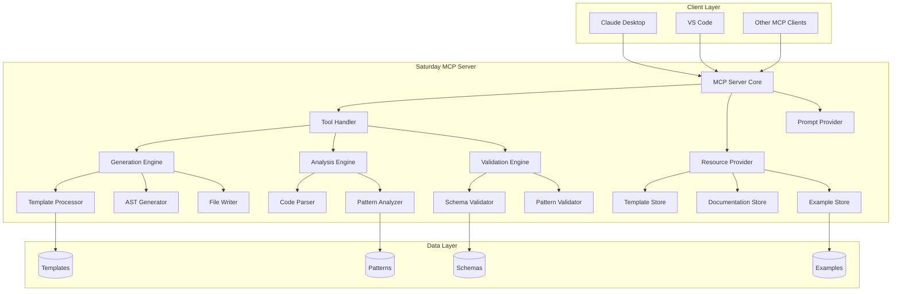

# Architecture

## High-Level Architecture
(See mermaid diagram in `docs/diagrams/high_level.md` or embed below)

## Component Architecture
- `cmd/` — entry point
- `internal/server/` — MCP server, handlers, tools, resources, prompts
- `internal/templates/` — loader, processor, registry, cache
- `internal/generators/` — site, page, flow, element, service, steps
- `internal/analyzers/` — framework, patterns, metrics
- `internal/validators/` — schema, pattern, naming
- `internal/models/` — request/response/schemas
- `internal/utils/` — fs, ast, logging, errors

