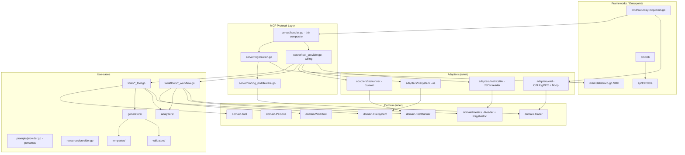

# Architecture

## Guiding Principles

The Saturday MCP Server follows Clean Architecture with a three-part domain vocabulary — the
**trinity**: `Tool`, `Persona`, `Workflow`. Every external dependency (filesystem, subprocess
execution, metrics file readers, OTel exporter) sits behind a domain interface with a concrete
implementation under `internal/adapters/`. Dependencies always point inward.

This shape is the outcome of the `mcp-add` retrofit — see
[../mcp-add-plan.md](../mcp-add-plan.md) for the historical trace of how the codebase moved from
a single 880-LOC `handler.go` God Object into the current layered structure. The two design
decisions worth their own record are captured as:

- [ADR-001](./adrs/ADR-001-use-invopop-jsonschema-tool-output-schemas.md) — declarative tool
  output schemas via `invopop/jsonschema`.
- [ADR-002](./adrs/ADR-002-default-otlp-grpc-otel-trace-export.md) — OTLP-over-gRPC as the OTel
  export default.

## Layers



Reading the arrows: every arrow terminates on something equal or more inward. Adapters implement
domain interfaces; the MCP protocol layer speaks in domain types; the entrypoint chooses which
adapter implementations to wire in.

## The Trinity

### Tool

Defined in `internal/domain/tool.go`. A `Tool` is one bounded MCP operation — generate a page,
validate patterns, parse a test failure. One Go type per registered tool, one file per type,
under `internal/tools/`.

The interface:

```go
type Tool interface {
    Name() string
    Description() string
    InputSchema() mcp.ToolInputSchema
    OutputSchema() *jsonschema.Schema
    Execute(ctx context.Context, request mcp.CallToolRequest) (*mcp.CallToolResult, error)
}
```

`OutputSchema()` is generated from a typed response struct in `internal/tools/responses.go`
using `github.com/invopop/jsonschema`. `RegisterTools` marshals the schema onto
`mcp.Tool.RawOutputSchema` so MCP clients can discover it. See
[ADR-001](./adrs/ADR-001-use-invopop-jsonschema-tool-output-schemas.md) for the rationale.

### Persona

Defined in `internal/domain/persona.go`. A `Persona` is a named, argument-shaped prompt
template registered with MCP as an `mcp.Prompt`. Rendering is pure — no I/O, no side effects,
so personas are testable without an MCP transport. The current persona set (10 of them —
`saturday_sme`, `migrate_test`, `self_heal_test`, `otel_metrics_expert`, `plan_feature`,
`explain_framework`, `debug_error`, `generate_gherkin`, `visual_page_object`,
`implement_feature`) lives in `internal/prompts/provider.go`.

### Workflow

Defined in `internal/domain/workflow.go`. A `Workflow` is a multi-step orchestration: parse
input → invoke adapter → analyze → format. Workflows differ from Tools in intent, not in
transport. They're adapted to the MCP wire via a thin `WorkflowTool` shim
(`internal/tools/workflow_tool.go`) that delegates `Tool.Execute` → `Workflow.Run`, so the MCP
protocol layer stays ignorant of whether it's driving a single-step Tool or a multi-step
Workflow.

Two workflows ship today:

- `run_tests` — `internal/workflows/run_tests_workflow.go`, composes a `TestRunner` adapter
  call with configurable timeout and result serialization.
- `prioritize_tests` — `internal/workflows/prioritize_tests_workflow.go`, composes a
  `MetricsReader` (domain interface, backed by the `metricsfile` adapter) with a
  `UsageAnalyzer` (domain use-case).

### When to use which

| You have…                                                             | Reach for a… |
|------------------------------------------------------------------------|--------------|
| A single bounded operation with a request/response shape               | Tool         |
| A prompt template that just wraps some arguments into an LLM message   | Persona      |
| Multi-step orchestration (load → analyze → format) or per-step spans   | Workflow     |

## Adapters

Every external dependency lives behind a domain interface:

| Domain interface        | Adapter                                | Notes                                              |
|-------------------------|----------------------------------------|----------------------------------------------------|
| `domain.TestRunner`     | `adapters/testrunner/exec_runner.go`   | `os/exec` wrapper with `context.WithTimeout`       |
| `domain.FileSystem`     | `adapters/filesystem/os_filesystem.go` | Backs `generate_documentation` — no more direct `os.WriteFile` |
| `domain/metrics.Reader` | `adapters/metricsfile/file_reader.go`  | JSON-file page-metric reader for `prioritize_tests`|
| `domain.Tracer`         | `adapters/otel/otel_tracer.go`         | OTLP-gRPC exporter; noop fallback in `adapters/otel/noop_tracer.go` |

Adapter selection happens in `cmd/saturday-mcp/main.go` (for the tracer, which depends on env
vars) and in `internal/server/tool_provider.go` (for everything else — the concrete adapters
are constructed once and passed to the tools/workflows that need them).

## MCP Protocol Layer

`internal/server/` is the thin seam between the MCP SDK and the domain use-cases:

- `handler.go` — a shallow composite (`Handler` struct) that carries the tool slice, a
  `domain.Tracer`, and the resource/prompt providers. Constructed via functional options
  (`WithTracer(...)`) so tests and dev runs default to a private no-op tracer without pulling
  the OTel adapter inward.
- `tool_provider.go` — `buildTools` constructs every collaborator (generators, analyzers,
  adapters) and returns the `[]domain.Tool` slice the handler holds. This is the single place
  concrete implementations get chosen.
- `registration.go` — `RegisterTools`, `RegisterResources`, `RegisterPrompts` iterate their
  respective provider slices and wire them into the MCP server. Every tool goes through
  `withTracing` before it reaches `s.AddTool`.
- `tracing_middleware.go` — wraps every tool `Execute` in a `Tracer.StartSpan`. Records
  `tool.name`, `tool.duration_ms`, `tool.success`, and `tool.error_class` on the span. No tool
  emits spans of its own — this is the only place span emission happens for tool invocations,
  which keeps the domain layer free of observability coupling (per
  `shared/rules/architecture-guardrails.md` #8).
- `testing.go` — public `HandleFoo` wrappers that the integration suite in
  `internal/integration/e2e_test.go` calls directly. Kept as thin delegations to the
  underlying `*Tool.Execute` so the ~1200-LOC e2e suite continues to serve as the
  response-shape regression net.

## Extension Points

### Add a Tool

1. Create `internal/tools/my_new_tool.go` implementing `domain.Tool` — `Name`, `Description`,
   `InputSchema`, `OutputSchema`, `Execute`.
2. Define a typed response struct in `internal/tools/responses.go`. `OutputSchema()` returns
   `jsonschema.Reflect(&MyNewResponse{})`.
3. Wire the tool into `buildTools` in `internal/server/tool_provider.go` — construct any
   collaborators it needs (generator, analyzer, or adapter interface) and append the new tool
   to the returned slice.
4. Add unit tests as `internal/tools/my_new_tool_test.go`. Use shared fakes from
   `internal/tools/testfixtures_test.go`; mock the adapter interfaces, never the SDK.
5. `internal/integration/e2e_test.go` picks the tool up automatically once it's registered.

No code in `internal/server/handler.go`, `registration.go`, or `tracing_middleware.go` changes.
Tracing wraps the new tool automatically.

### Add a Workflow

1. Create `internal/workflows/my_workflow.go` implementing `domain.Workflow`. Take adapter
   interfaces (not concrete types) as constructor arguments.
2. Register it in `buildTools` via `tools.NewWorkflowTool(workflows.NewMyWorkflow(...))`. The
   `WorkflowTool` adapter presents it to MCP as a tool.
3. Test the workflow directly (unit test in `internal/workflows/`) — no need to test the shim.

### Add an Adapter

1. Define the interface in `internal/domain/<capability>.go` — small, focused, named for what
   it does (`FileSystem`, `TestRunner`, `Tracer`, not `IFileSystem`).
2. Implement it under `internal/adapters/<capability>/`. One package per capability, so
   consumers only import what they need.
3. Any tool or workflow that needs it takes the interface in its constructor. Choice of
   concrete implementation happens once, in `buildTools` (or in `main.go` for adapters whose
   selection depends on runtime configuration — the OTel tracer is the current example).

### Add a Persona

1. Add the definition to the slice inside `internal/prompts/provider.go`. Personas are
   currently defined inline as `mcp.Prompt` descriptors with argument shapes; rendering logic
   is a switch in `Get`. If this grows further, extracting each persona to its own file
   implementing `domain.Persona` (mirroring how tools were extracted from `handler.go` in the
   retrofit) is the natural next step.

## Observability

OTel is opt-in and defaults to a no-op tracer. Configuration is via `OTEL_EXPORTER_OTLP_ENDPOINT`
(gRPC host:port) and `OTEL_EXPORTER_OTLP_INSECURE` (plaintext gate). The entrypoint chooses
between the real tracer and the noop; if the real tracer's construction errors at startup, the
entrypoint logs and falls back to noop rather than exiting — an observability failure never
takes down the MCP server, only degrades what it exports. See
[ADR-002](./adrs/ADR-002-default-otlp-grpc-otel-trace-export.md).

Where spans get emitted:

- **Tool invocation spans** — emitted by `internal/server/tracing_middleware.go` around every
  registered tool's `Execute`. Attributes: `tool.name`, `tool.duration_ms`, `tool.success`,
  `tool.error_class` (on failure).
- **Adapter spans** — the `TestRunner` and `FileSystem` adapters are the natural place to add
  operation-level spans as OTel adoption deepens.
- **Domain / use-case layer** — zero span calls. If a tool or workflow needs to emit
  business-level spans, it receives a `domain.Tracer` in its constructor — never
  `go.opentelemetry.io/otel` directly.

The unrelated `internal/domain/metrics/` package (page-usage metrics for the
`prioritize_tests` workflow) is a **domain** concept, not an OTel concept. It survived the
retrofit under a clearer name for exactly that reason — see plan Phase E, op 13.

## Testing

Every tool and workflow has a `_test.go` sibling using mocked adapter interfaces (fixtures in
`internal/tools/testfixtures_test.go`). `internal/integration/e2e_test.go` remains the
cross-tool acceptance surface — it exercises the public `HandleFoo` wrappers rather than
reaching into `internal/tools/`, so it doubles as the response-shape regression net.

Framework-wide targets (see [CLAUDE.md](../CLAUDE.md)):

- Unit test coverage ≥ 85% per package (adapters and workflows meet this comfortably; some
  server-package files are covered indirectly via e2e).
- Cyclomatic complexity < 7 per function.

## Historical Context

The trinity vocabulary, adapter layer, output schemas, and OTel wiring all landed via the
`mcp-add` retrofit — a full sweep over the pre-retrofit codebase where `handler.go` was an
880-LOC God Object registering everything directly. [../mcp-add-plan.md](../mcp-add-plan.md)
carries the full plan (Phases A–J), the operation-by-operation history, deviations from the
plan (with rationale), and the known gaps that remain as follow-up work.
